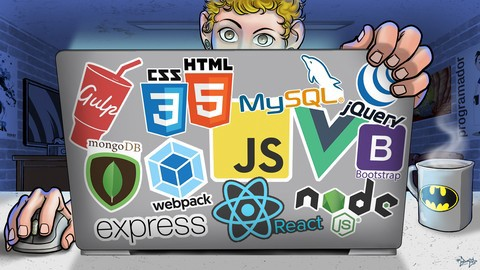

<h1 align="center">
  Curso Web Moderno Completo com JavaScript 2021 + Projetos
</h1>

<p align="center">
  
  
  
  
  <a href="https://github.com/daviteixeira-btm/Curso-Web-Moderno/commits">
    
  </a>
  
  

  
	 
</p>
<p align="center">
  <a href="#-about-the-course">About the course</a>&nbsp;&nbsp;&nbsp;|&nbsp;&nbsp;&nbsp;
  <a href="#-technology">Technology</a>&nbsp;&nbsp;&nbsp;|&nbsp;&nbsp;&nbsp;
  <a href="#-installation-execution-and-development">Installation, execution and development</a>&nbsp;&nbsp;&nbsp;|&nbsp;&nbsp;&nbsp;
  <a href="#-how-to-contribute">How to contribute</a>&nbsp;&nbsp;&nbsp;|&nbsp;&nbsp;&nbsp;
  <a href="#-license">License</a>
</p>



## 👨🏻‍💻 About the course
```👨🏻‍💻 Sobre o projeto```
<p>Curso Web Moderno Completo com JavaScript 2021 + Projetos</p>
<p>Com o objetivo de aprender sobre a Web, 14 Cursos + Projetos, Javascript, Angular, React, Vue, Node, HTML, CSS, jQuery, Bootstrap, Webpack, Gulp e MySQL.</p>

## 🚀 Technology
```🚀 Tecnologias```

- [JavaScript](https://developer.mozilla.org/pt-BR/docs/Web/JavaScript)
- [Node.js](https://nodejs.org/en/)

## 💻 Installation, execution and development
```💻 Instalação, execução e desenvolvimento```

### Prerequisites
```💻 Pré-requisitos```

- [Node.js](https://nodejs.org/en/)
- [npm](https://www.npmjs.com/)

### 🌐 Web
```bash
### Install the dependencies
# Instale as dependências
$ npm install
$ npm init

### Ready to start the web application
# Tudo pronto para iniciar a aplicação web
$ gulp

```
## 🤔 How to contribute
```🤔 Como contribuir```

**Fork the repository and follow the steps below**<br>
```Faça um fork deste repositório e siga os passos a baixo```

```bash
### Clone your fork
# Clone seu fork
$ git clone seu-fork-url && cd NOME_DO_REPO

### Create a branch with your feature
# Crie uma branch com sua feature
$ git checkout -b my-feature

### Commit your changes
# Faça commit das suas alterações
$ git commit -m 'feat: My new feature'

### Send the code to your remote branch
# Envie o código para sua remote branch
$ git push origin my-feature
```
**After your pull request is merged, you can delete your branch** <br>
```Depois que sua pull request for merged, você pode deletar sua branch```

## 📝 License

This project has a MIT License - see the [LICENSE](./ LICENSE) for more details.<br>
```Este projeto possui uma Licença MIT License - veja o arquivo [LICENSE](./LICENSE) para mais detalhes.```

---

<div align="center">

Made with ❤️ by Davi Teixeira

</div>
